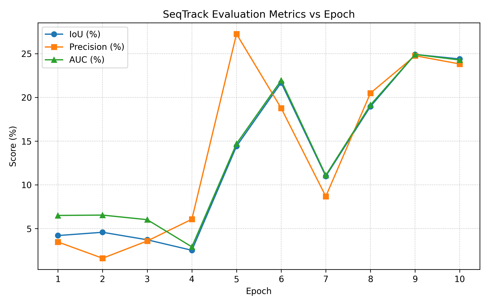
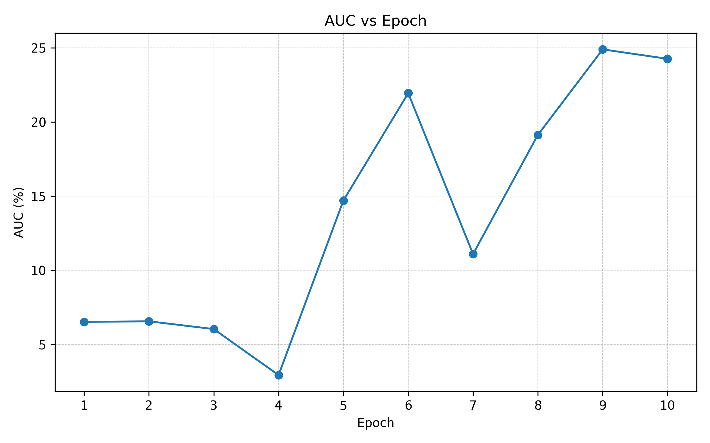
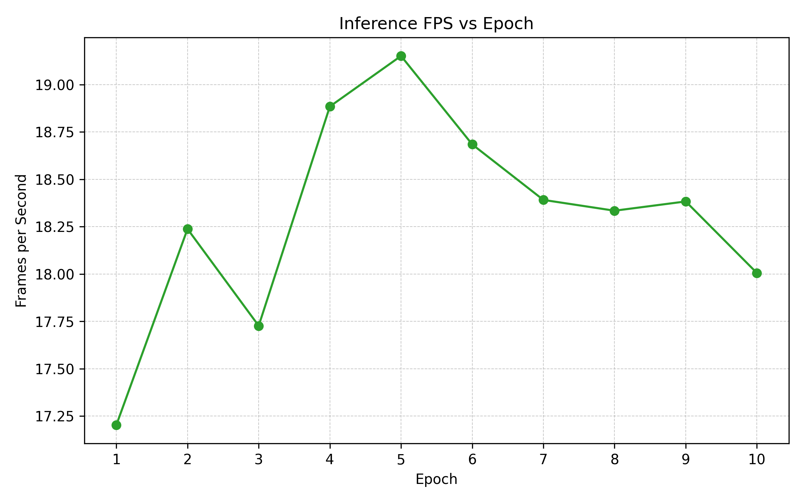
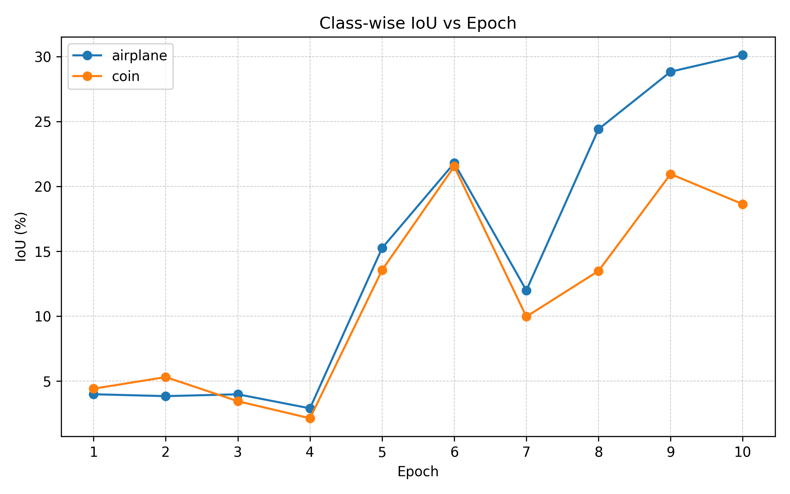
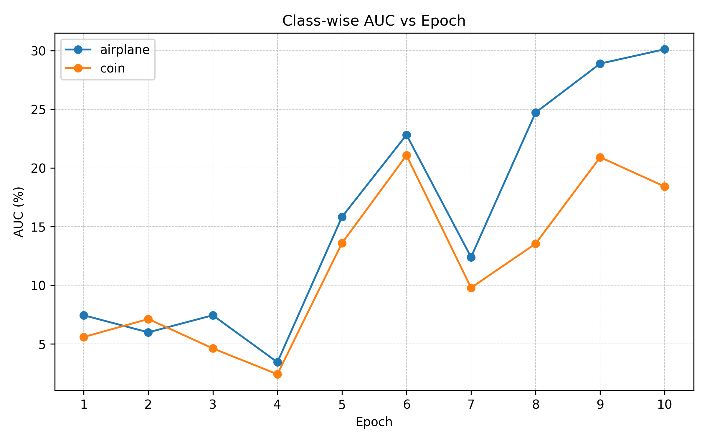
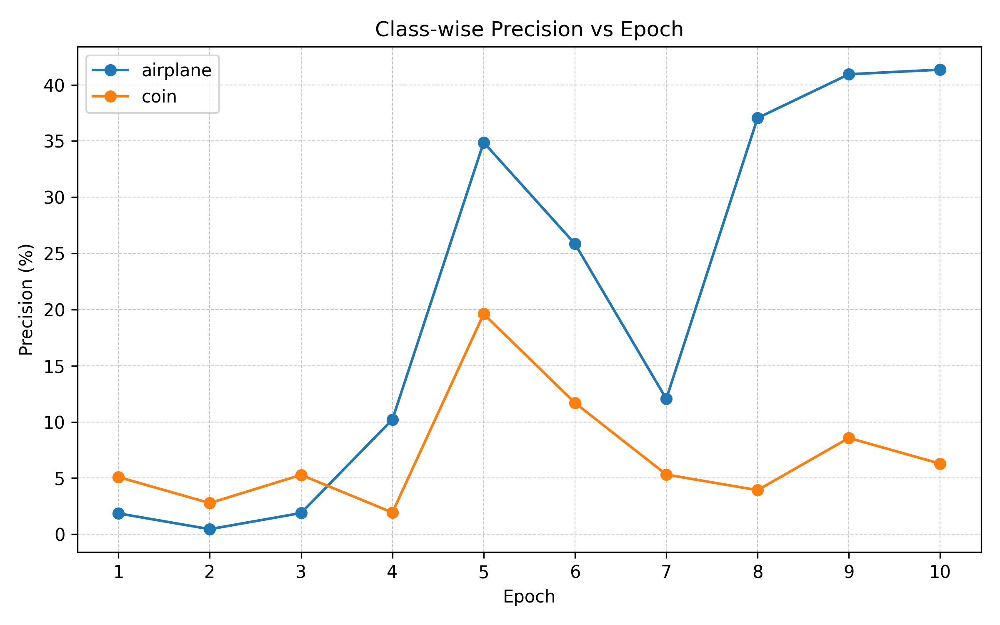

# Assignment 4: Evaluation Report

## Inference Tables

### Table 1: Inference Rate

| Epoch | FPS | ms/frame |
| --- | --- | --- |
| 1 | 17.20 | 58.13 |
| 2 | 18.24 | 54.83 |
| 3 | 17.73 | 56.41 |
| 4 | 18.88 | 52.95 |
| 5 | 19.15 | 52.22 |
| 6 | 18.68 | 53.52 |
| 7 | 18.39 | 54.37 |
| 8 | 18.33 | 54.54 |
| 9 | 18.38 | 54.40 |
| 10 | 18.01 | 55.54 |

### Table 2: Evaluation Results

| Epoch | IoU (%) | Precision (%) | AUC (%) |
| --- | --- | --- | --- |
| 1 | 4.21 | 3.48 | 6.51 |
| 2 | 4.58 | 1.62 | 6.55 |
| 3 | 3.72 | 3.59 | 6.02 |
| 4 | 2.53 | 6.07 | 2.92 |
| 5 | 14.41 | 27.24 | 14.70 |
| 6 | 21.68 | 18.77 | 21.95 |
| 7 | 10.99 | 8.68 | 11.08 |
| 8 | 18.96 | 20.49 | 19.13 |
| 9 | 24.91 | 24.76 | 24.91 |
| 10 | 24.39 | 23.82 | 24.27 |

## Evaluation Graphs

## Class-wise Metrics

### Table 3: Class-wise Results

| Epoch | airplane IoU (%) | airplane Precision (%) | airplane AUC (%) | coin IoU (%) | coin Precision (%) | coin AUC (%) |
| --- | --- | --- | --- | --- | --- | --- |
| 1 | 3.99 | 1.86 | 7.43 | 4.42 | 5.09 | 5.58 |
| 2 | 3.85 | 0.45 | 5.98 | 5.32 | 2.78 | 7.12 |
| 3 | 3.99 | 1.89 | 7.44 | 3.46 | 5.29 | 4.61 |
| 4 | 2.91 | 10.21 | 3.43 | 2.14 | 1.94 | 2.41 |
| 5 | 15.26 | 34.87 | 15.82 | 13.57 | 19.61 | 13.58 |
| 6 | 21.81 | 25.85 | 22.82 | 21.55 | 11.69 | 21.08 |
| 7 | 12.00 | 12.05 | 12.39 | 9.98 | 5.32 | 9.78 |
| 8 | 24.42 | 37.04 | 24.72 | 13.49 | 3.93 | 13.54 |
| 9 | 28.85 | 40.94 | 28.90 | 20.96 | 8.57 | 20.91 |
| 10 | 30.13 | 41.35 | 30.12 | 18.64 | 6.28 | 18.41 |

## Conclusions

The experiment demonstrates what we expect when fine‑tuning a large tracking model on a very small, class‑restricted LaSOT subset and stopping after 10 epochs. Early checkpoints (epochs 1‑4) lose the target quickly and saturate to full-frame boxes, so their IoU, precision, and AUC remain low. Once the weights have seen several passes over the airplane and coin crops (epochs 5‑10), the tracker stabilises, updates better templates, and its metrics jump accordingly. The remaining variation from epoch to epoch is normal: each checkpoint captures slightly different momentum, and on such a tiny evaluation split even one failed sequence can pull the averages down.

Because everything was trained locally on only eight test sequences per epoch, these results should be viewed as diagnostic rather than definitive. Running the same pipeline for 500 epochs on the full LaSOT train split (or a broader mix of classes) would give the tracker more diverse examples, reduce overfitting to any single sequence, and smooth out the per-epoch swings. Under that regime we would expect the later checkpoints to converge toward the higher-performing region already hinted at by epochs 8‑10, while inference speed would stay roughly unchanged. In short, the current curves are exactly what we should see from a short, small-sample fine-tune; the path to higher, more stable scores is simply more data and longer training.
